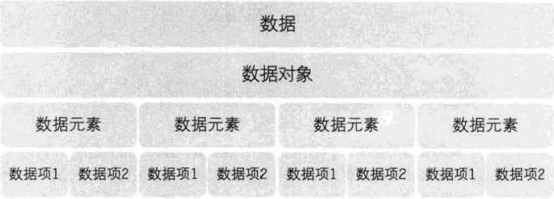
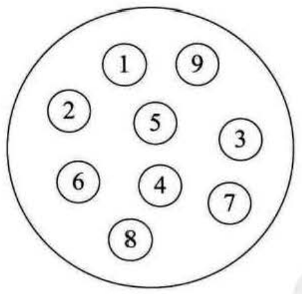
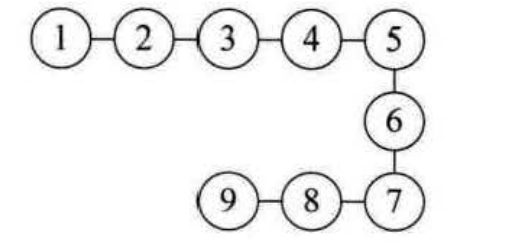
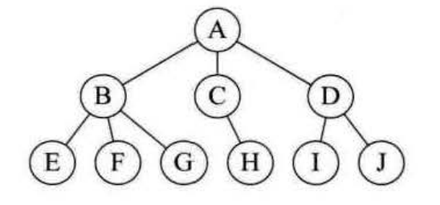
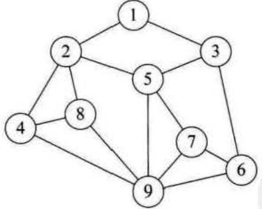
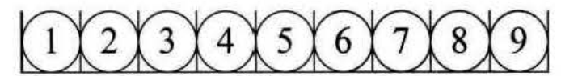
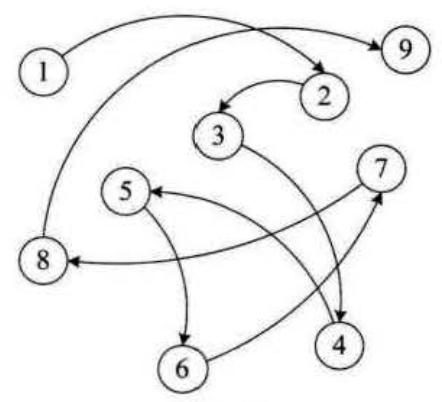
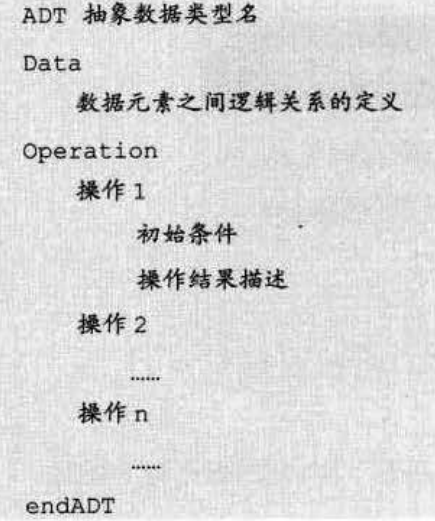

# 数据结构绪论

## 基本概念和术语

* 数据：能输入计算机且能被计算机处理的各种符号的集合
    * 数值型数据：整数、实数等
    * 非数值型数据：文字、图像、声音等

* 数据元素：数据的基本单位，通常作为一个整体来进行考虑和处理
    * 比如：一个学生的所有信息，就可以看做一个数据元素(姓名、性别、学号等)
    * 也称为 元素、记录、结点、顶点。和数据是个体与集合的关系

* 数据项：构成**数据元素**的不可分割的最小单位
    * 比如：学生信息中的 姓名、性别，这两个都是数据项

* 数据对象：性质相同的数据元素的集合，是数据的一个子集
    * 比如：整数数据对象、学籍表数据对象
    * 和数据是集合与子集的关系

* **总结**：数据 -> 数据元素 -> 数据项

* 术语之间的关系

* 数据结构：相互之间存在一种或多种特定关系的**数据元素**的集合

### 逻辑结构和物理结构

* 逻辑结构：数据对象中数据元素之间的相互关系
    * 集合结构：集合结构中的数据元素除了同属于一个集合外，他们之间没有任何关系
    * 线性结构：数据元素之间是一对一的关系
    * 树形结构：一对多的层次关系
    * 图形结构：多对多

* 物理结构(存储结构)：逻辑结构在计算机中的存储形式，可分为顺序存储、链式存储
    * 顺序存储结构：数据元素放在地址连续的存储单元里，数据间逻辑关系和物理关系是一致的
    * 链式存储结构：数据元素存放在任意的存储单元，这组存储单元可以连续也可以不连续因为存储关系不能反应逻辑关系，所以需要用一个指针来存放数据元素的地址，这样可以通过地址来找到相关联数据元素的位置

* 抽象数据类型(Abstract Data Type，ADT)：一个数学模型及定义在该模型上的一组操作
